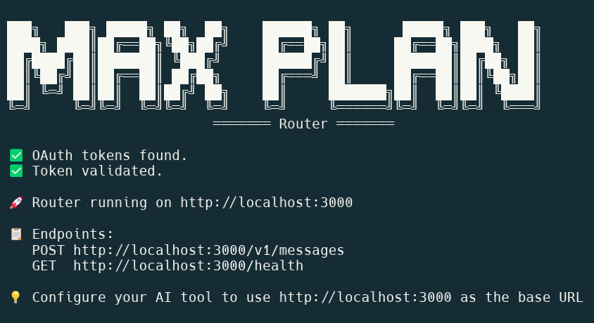

# Anthropic MAX Plan OAuth - TypeScript Implementation

<div align="center">



*Interactive menu-driven CLI to demonstrate Anthropic MAX plan OAuth usage*

[](https://opensource.org/licenses/MIT)
[](https://www.typescriptlang.org/)
[](https://nodejs.org/)
[](https://github.com/nsxdavid/anthropic-oauth-max-plan)

</div>

---

## About This Repository

This repository provides **technical documentation and a proof-of-concept implementation** for using Anthropic's Claude MAX subscription plans with your own code.

Claude MAX plans ($100/month or $200/month) provide flat-rate billing for high-volume API usage. This repo explains how to authenticate using OAuth and make API requests that Anthropic accepts as coming from authorized coding tools.

**Special thanks to [OpenCode](https://github.com/sst/opencode)** - studying its OAuth implementation made this project possible.

---

> **⚠️ EDUCATIONAL AND ENTERTAINMENT PURPOSES ONLY**
>
> This project is provided for educational, research, and entertainment purposes only. It is not affiliated with, endorsed by, or sponsored by Anthropic PBC. Use of this software is at your own risk. The authors and contributors make no warranties and accept no liability for any damages or issues arising from use of this code. Users are responsible for ensuring their use complies with Anthropic's Terms of Service and all applicable laws. This software is provided "as-is" without any express or implied warranties.

## Requirements

- **Claude MAX Subscription** from [claude.ai](https://claude.ai)
- **Node.js** 18+

## Quick Start

```bash
npm install
npm start
```

Select option 1 to authenticate, visit the authorization URL, and paste the `code#state` when prompted.

## Project Structure

```
src/
├── cli.ts               # Interactive CLI (entry point)
├── oauth.ts             # OAuth PKCE flow implementation
├── client.ts            # API client with validation
├── token-manager.ts     # Token storage and refresh
└── types.ts             # TypeScript definitions
```

## Technical Documentation

See [`ANTHROPIC-MAX-PLAN-IMPLEMENTATION-GUIDE.md`](./ANTHROPIC-MAX-PLAN-IMPLEMENTATION-GUIDE.md) for:
- Complete OAuth flow details
- System prompt validation requirements
- API request format
- Token management
- Implementation patterns

## Author

**nsxdavid (David Whatley)**
- Website: [davidwhatley.com](https://davidwhatley.com)
- GitHub: [@nsxdavid](https://github.com/nsxdavid)

## License

MIT

## Disclaimer

This demonstrates Anthropic's official OAuth flow with MAX subscription. All authentication uses Anthropic's official endpoints. This is the same OAuth flow as Claude Code.

Anthropic may change OAuth requirements at any time. Tested and verified working as of November 1st, 2025.
